# Além da Concha: Classificação de Abalone Utilizando Aprendizado de Máquina

## Sobre o Abalone
O Abalone é um molusco gastrópode marinho, conhecido pela sua concha única e carne valorizada na gastronomia. Pertencente ao gênero *Haliotis*, o Abalone habita águas costeiras em várias partes do mundo e é conhecido por diferentes nomes culturalmente. Na biologia e na ecologia marinha, o Abalone é objeto de estudo devido à sua importância tanto na cadeia alimentar quanto na pesca comercial. Este projeto busca explorar as características biológicas do Abalone, utilizando métodos de aprendizado de máquina para classificar diferentes tipos desta espécie, com base em atributos morfológicos e físicos.

## Sobre o Problema

Este projeto utiliza um conjunto de dados modificado, originado a partir do UCI Machine Learning Repository: Abalone Data Set. O conjunto original foi adaptado e refinado com o objetivo de aprimorar a análise e a precisão do modelo de classificação. 

Nosso principal objetivo é desenvolver um modelo de aprendizado de máquina capaz de prever com eficácia o 'type' do Abalone (entre as classes I, II e III) utilizando as informações fornecidas em [data](/data).

Atributos do dataset:
- Sex: M, F e I (infantil)
- Length: maior medida em mm da concha
- Diameter: diametro em mm perpendicular a medida Length
- Height: altura em mm com a carne dentro da concha
- Whole weight: peso em gramas de toda a abalone
- Shucked weight: peso em gramas da carne
- Viscera weight: peso em gramas das víceras após escorrer
- Shell weight: peso em gramas para a concha após estar seca
- Type: variável de classe (1, 2 ou 3) para o abalone

## Visualização Dos Dados

### Dataframe
Como podemos observar não temos dados NAN.

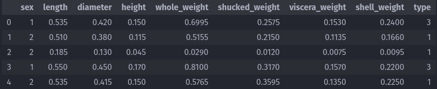
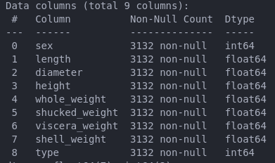

### Histogramas
Analize indespensavel para compriender melhor como está distribuido as variaveis da base, se isso está se dando de maneira uniforme o que pode influenciar na seleção de um classificador e identificar outlines.

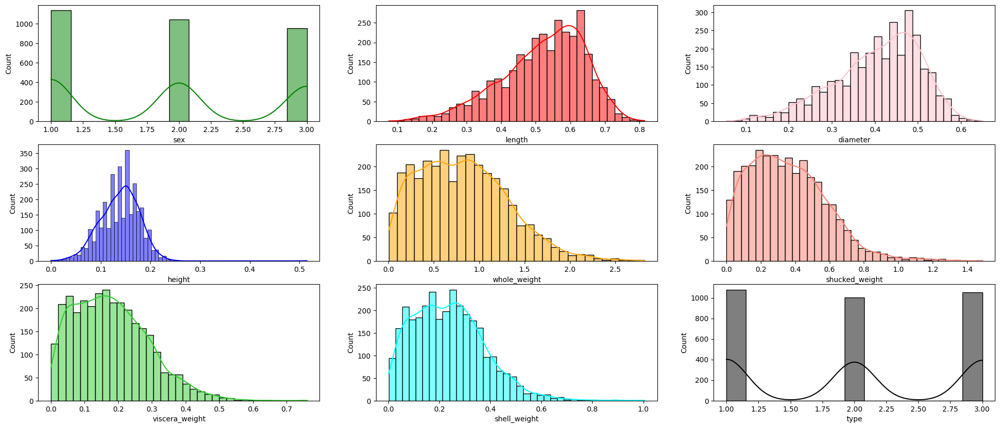

### Distribuição e Variação das Dimensões Físicas e Peso do Abalone por Tipo
Analize crucial para detecção de caracteristica que podem ser essenciais para a determinação do tipo do abalone.

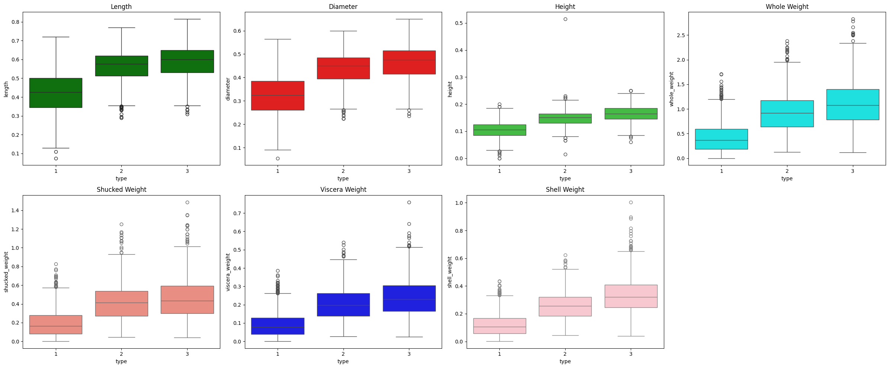

### Hotmap
Note que as correlações são esperadas em virtude da natureza das variaveis que são medidas do abalone em sua maioria.

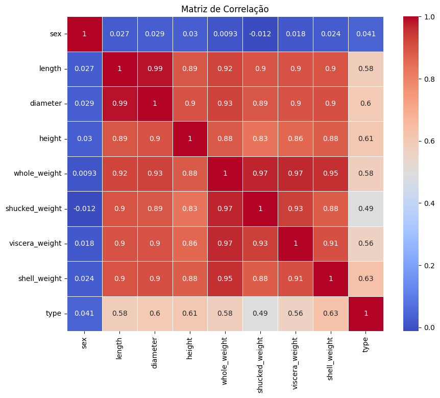

### Graficos De Dispersão
Uma vez que a variavel whole_weight, como podemos observar no Hotmap, é a variavel que possui maior relação com as demais ela será usada como base para gerar grafico de disperção com linhas de tendência o que iremos usar para amenizar ruidos.

    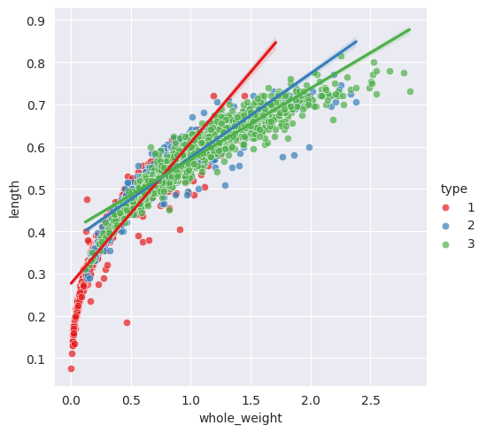
    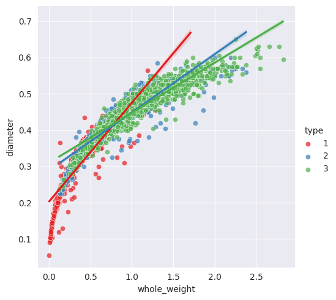
    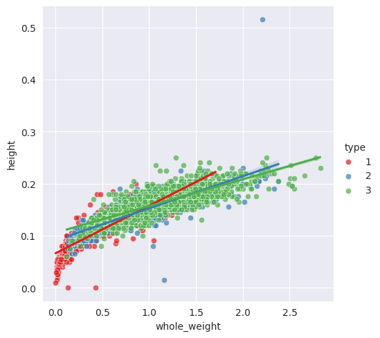

    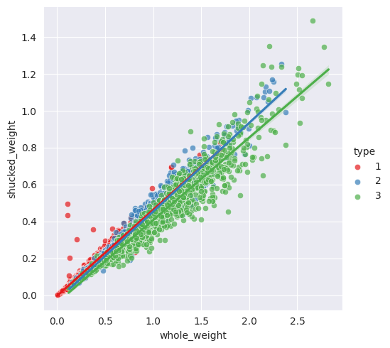
    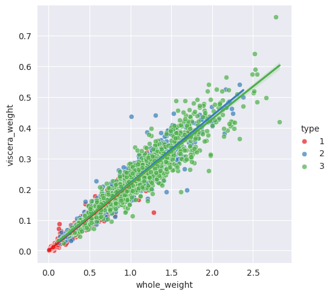
    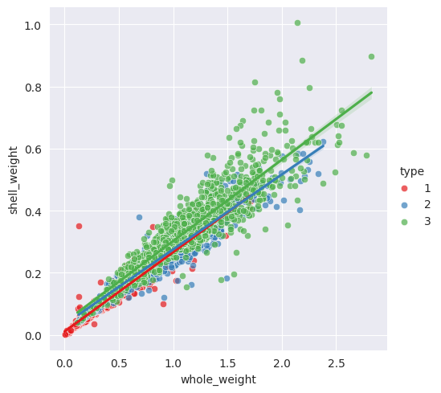

## Modelos De Apredisagem Utilizados 

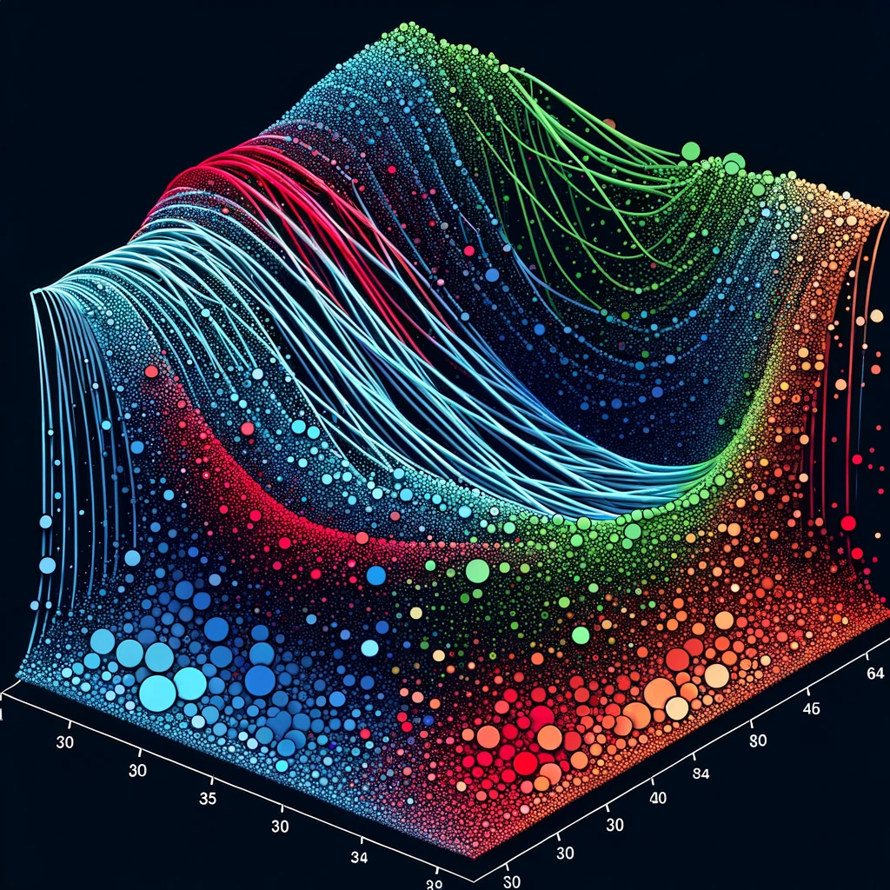

---

> "A revolução no software que está a acontecer... vai surpreender as pessoas na medida em que, dentro de cinco anos, os melhores programas de software farão coisas que você não acredita."
>
> — **Bill Gates**

---
### Falando Um Pouco Sobre SVM

O Support Vector Machine (SVM) é um modelo de aprendizado de máquina poderoso e versátil, usado tanto para classificação quanto para regressão. Em termos simples, o SVM tenta encontrar um hiperplano ou conjunto de hiperplanos em um espaço de alta dimensão que possa separar com distinção as diferentes classes de dados. 

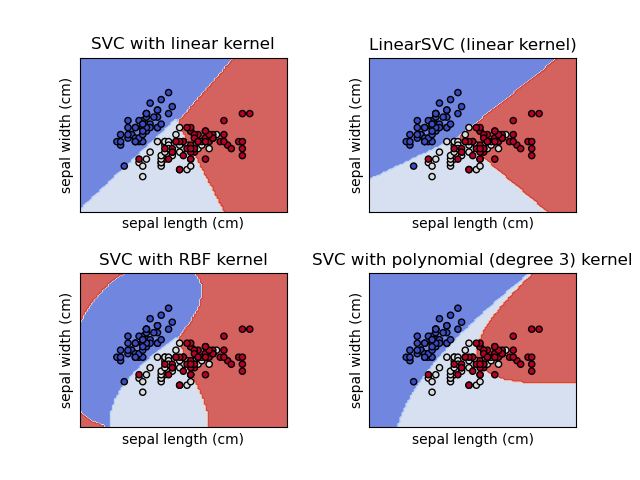

### Funções do Kernel 
Kernels são funções matemáticas utilizadas pelo SVM para transformar o espaço de entrada em um novo espaço, mais apropriado para a separação das classes. Esta transformação é fundamental, especialmente quando os dados de entrada não são linearmente separáveis no espaço original. Ao aplicar um kernel, o SVM é capaz de realizar classificações complexas e não lineares, encontrando um hiperplano ótimo em um espaço de maior dimensão.

### Configuração C
Ele controla a compensação entre alcançar um hiperplano de separação com uma margem máxima e minimizar a classificação errada de pontos de treinamento.

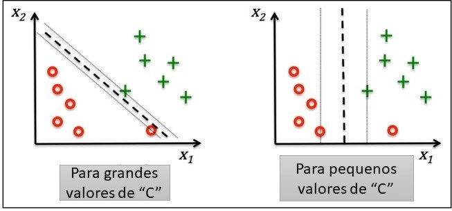

## Extra

### T-SNE: t-Distributed Stochastic Neighbour Embedding2
####  (t-SNE, pronunciado tí-ciní) é uma técnica de visualização em 1D, 2D ou 3D de datasets de altas dimensões.
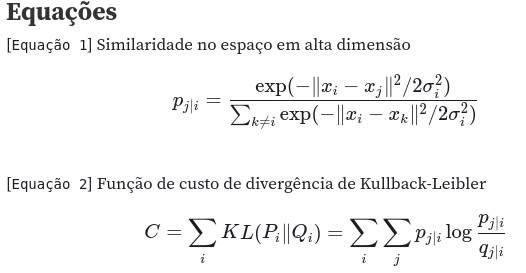

### Aplicando T-SNE no problema 

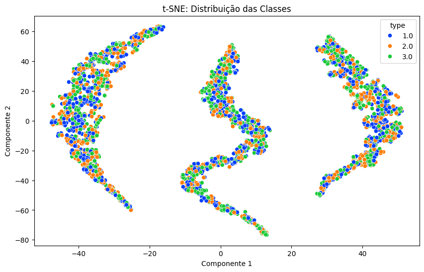

### GridSearchCV: é uma ferramenta poderosa!

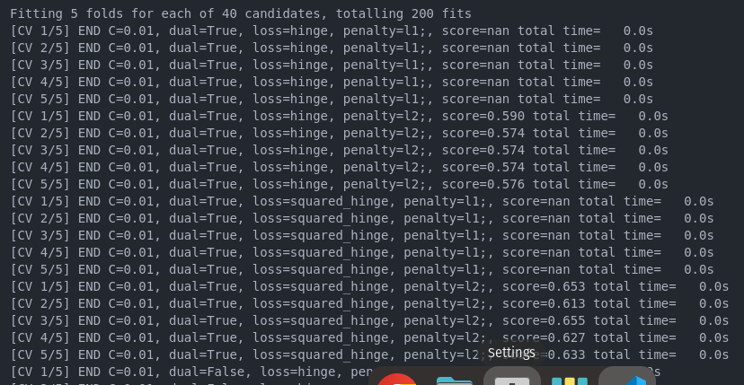

## Resultados Obtidos

### Modelo com kernel linear 
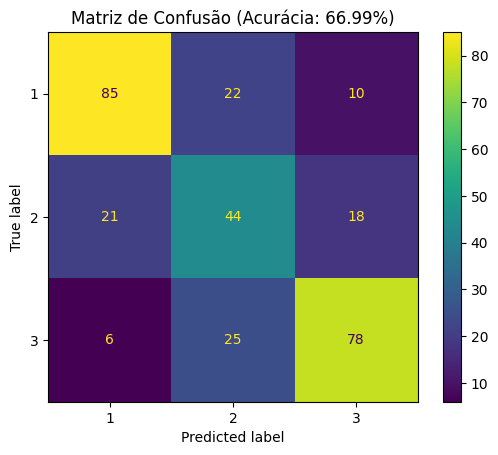

### MOdelo com kernel Kernel RBF
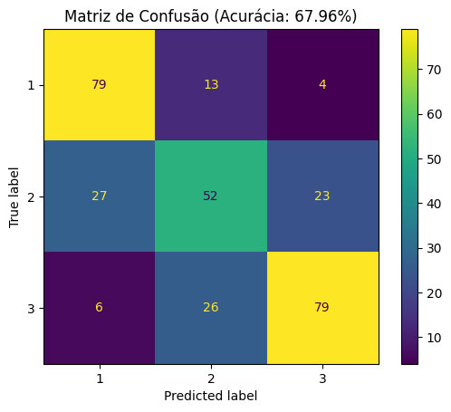

## Referências

- WIKIPÉDIA. *Haliotis*. Disponível em: <https://pt.wikipedia.org/wiki/Haliotis>.
- kaggle. Disponível em: <https://www.kaggle.com/code/sanchitvj/abalone-age-prediction/notebook>
- Scikit learn. *Documentação*. Disponível em : <https://scikit-learn.org/stable/modules/svm.html#tips-on-practical-use>
- Peplow, M. (2006). Synthetic biology: The best of both worlds. Nature Biotechnology, 24(12), 1565. <https://doi.org/10.1038/nbt1206-1565>
- Stelling, R. (Data da publicação não especificada). t-SNE. Observable. <https://observablehq.com/@robstelling/t-sne#tsneAlgoritmo1>